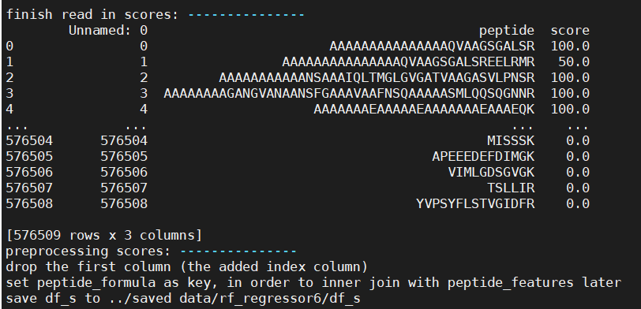
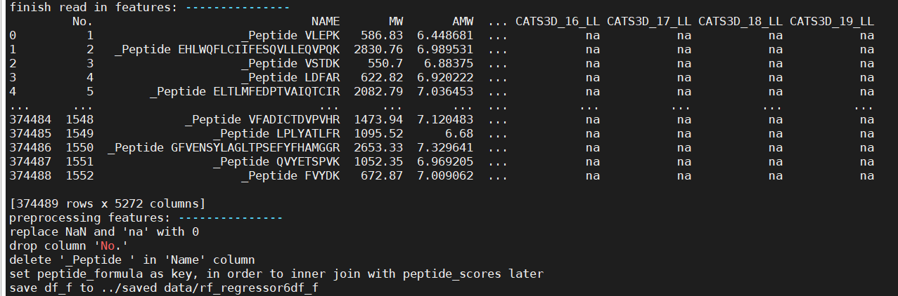

# random-forest
**stage two of the project -- feature elimination, finding the most important chemical features in deciding peptides' scores**

# rf_regressor6.py

* The code will preprocess peptides' scores and features, and reduce the number of features

  It can be separated into two parts: data preprocessing and feature elimination

* Default file structure:

  ```
  - src
      - rf_regressor6.py
  - input
      - all dragon.txt (have uploaded to github)
      - score.csv (output of stage one of the project)
  - saved data (output)
      - rf_regressor6 
      	- df_s (have been uploaded to Teams gourp file)
      	- df_f (have been uploaded to Teams gourp file)
      	- df_dataset (have been uploaded to Teams gourp file)
      	- rfe_(n_training_samples) (rfe2_204116 have been uploaded to Teams gourp file))
      		- dataset_dict
      		- rfe_dict
      		- rfe_prediction
  ```

## Data Preprocessing

1. generate and save`df_dataset`

   * Implemented by `generate_dataset` method

   * `df_dataset` is the data needed for training models. The method will merge peptides' scores and peptides' features.

   * parameters:

     ```python
     #  data loading options
     need_init_dataset = True
     need_init_score = True
     need_init_feature = True
     chunk_size = 50000  # for reading in feature_file
     
     #  input files
     score_file = '../input files/score.csv'
     feature_file = "../input files/all_dragon.txt"
     ```


     - If `need_init_dataset` is set to False, which means `df_dataset `has been made, and then all that need to be done is just load`df_dataset` from saved data.
    
       If `need_init_dataset` is set to be true, it will depends on the values of `need_init_score `and `need_init_feature` to decide whether to preprocess or to just load in the `df_s` and `df_f`.

   * If the code runs for the first time, set the three `need_` parameters to `True`.

   * Need to change `preprocess_scores` and `preprocess_features` methods if data format in `score_file` and `feature_file` changes.

     `score_file`:

     

     `feature_file`:

     ​	


2.  Will generate a picture (x = peptide_length, y = peptide_score) in `saved data/rf_refressor6` if setting `need_score_length_pic = True`

3. generate and save`X_train, y_train, X_test, y_test`

   (test set is sorted by score)

   Parameters:

   ```python
   # The percentage of needed data to create training and testing sets
   data_portion = 0.01  # (0,1], set to 1 if using all the peptides
   
   # whether to save X_train, y_train, X_test, y_test 
   # if true, will save to 'saved data/rf_regressor6/rfe_(n_training samples)/data_dict
   save_dataset_dict = True
   ```

   

## Feature Elimination

* implemented by `recursive_feature_eilmination`

  (It is altered from`sklearn.feature_selection.RFE`, and I didn't use recursion here...)

* Example usage:

  ```python
  rfe_dict = {}
  # initialization for n_all_features
  n_features = df_dataset.shape[1] - 1 # number of all the features: 1907
  support = np.ones(n_features, dtype=bool)
  ranking = np.ones(n_features, dtype=int)
  rfe_dict[n_features] = {'support': support, 'ranking': ranking, 'score': 9999}
  
  # The first n features to select, 
  # the first element in n should be an existing key in rfe_dict, no score for the last element of n
  n = [1907, 1000, 700, 500, 400, 300, 200, 100, 70, 60, 50, 40, 30, 20, 10, 5, 1, 0]
  o_n = n[:-1]
  t_n = n[1:]
  for origin_n_features, target_n_features in zip(o_n, t_n):
      rfe_dict = recursive_feature_elimination(...)
  ```
  
* Code above will return and save a dictionary storing `support`, `ranking`, `score` for different number of features . 
  
    ```python
    # To check the most important n features
    support = rfe_dict[target_n_features]['support']
    features = np.arange(n_all_features)[support]
    # To use these features..
    X_test.iloc[:, features]
    ...
  
  
    
